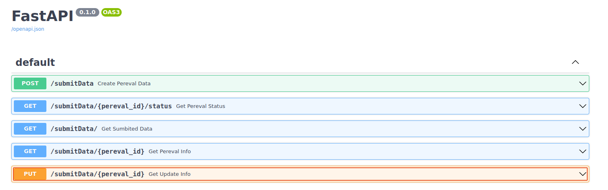

# FSTR backend api

#### -Для просмотра swagger страницы перейти по адресу: 176.119.147.185:8888/docs Выбрать нужный endpoint где будет указан ожидаемый формат запросы
### -При неудачных запросах будет выведено сообщение об ошибке и статус код.
### -Для удобного развертывания приложения имеется Dockerfile
### -Создание базы данных в docker-compose исключительно в демонстрационных целях. 
### -Подключение к базе данных задается через переменные окружения (имя базы данных - pereval):
 * FSTR_DB_HOST 
 * FSTR_DB_PORT
 * FSTR_DB_LOGIN
 * FSTR_DB_PASS

### - Дополнительно добавил в таблицу pereval_images поле с внешним ключом на таблицу pereval_added, для связи записей, посмотреть структуру можно в init.sql
### - Пример валидного json-a для создания записи
```json
{
  "date_added": "2022-03-06 08:29:34",
  "raw_data": {
    "pereval_id": 132,
    "beautyTitle": "Круглица",
    "title": "Вершина 42",
    "other_titles": "Завилуха",
    "connect": "",
    "user": {
      "id": 64,
      "email": "base@user.su",
      "phone": "89124635182",
      "fam": "Калинин",
      "name": "Антон",
      "otc": "Павлович"
    },
    "coords": {
      "latitude": 23,
      "longitude": -56.423,
      "height": 1124
    },
    "type": "pass",
    "level": {
      "winter": "",
      "summer": "",
      "autumn": "2A",
      "spring": "1C"
    }
  },
  "images": {
    "sedlo": [
      1, 2
    ],
    "West": [],
    "South": [4],
    "East": [4, 6, 7]
  },
  "status": "new",
  "byte_images": [
    {
      "date_added": "2022-03-06 08:29:34.835",
      "img": "sdkfjsdlfndfjlnsadojfm]asdfasd"
    },
    {
      "date_added": "2022-03-06 09:29:34.835",
      "img": "sadsfadsfaedsfdsafsdfsadfd"
    },
    {
      "date_added": "2022-03-06 08:33:34.835",
      "img": "asdfasdasdas"
    }
  ]
}
```

